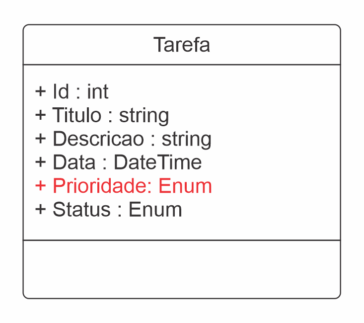
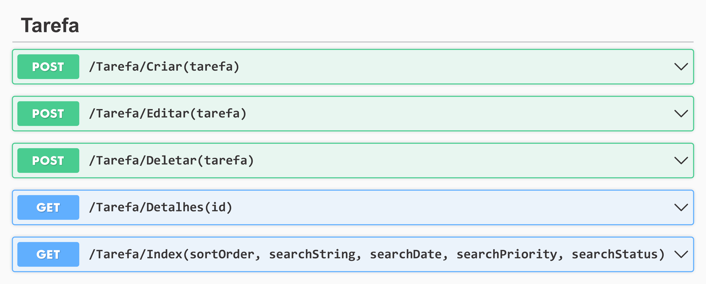
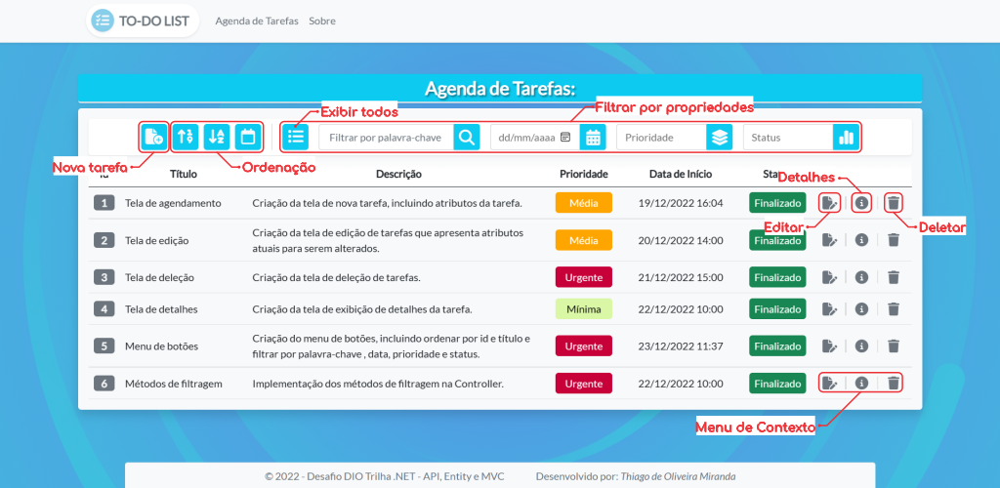
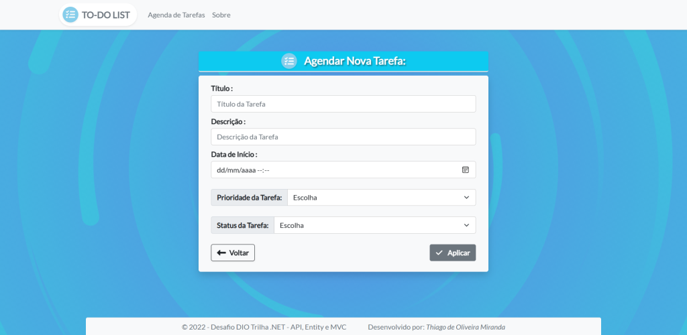
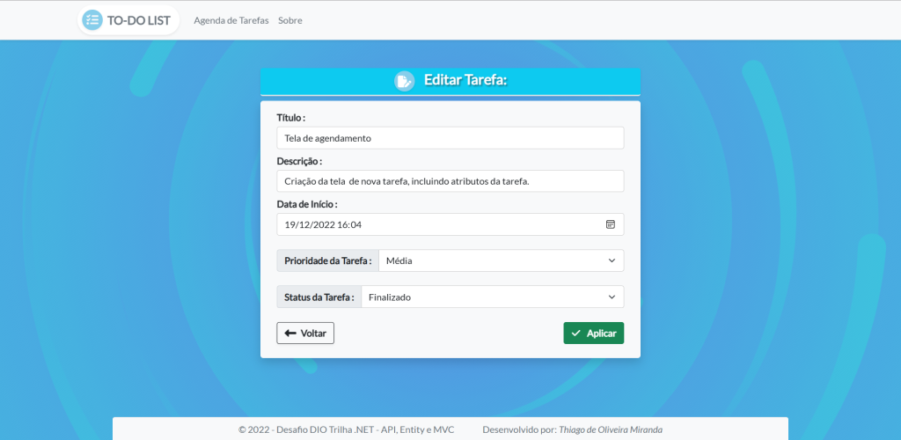
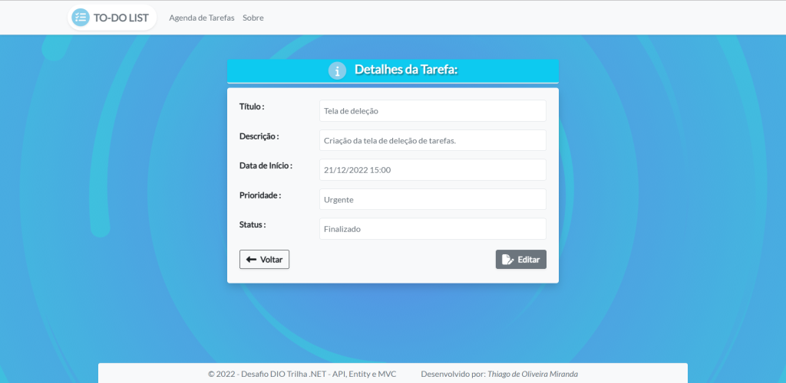
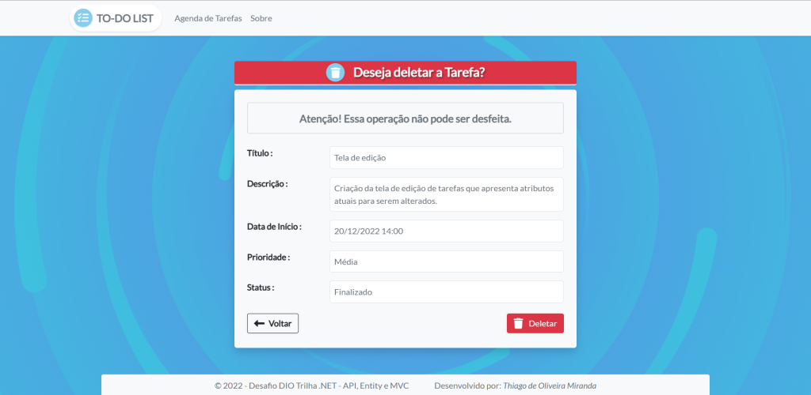

# DIO - Trilha.NET - API e Entity Framework

_Versão por:_ **Thiago de Oliveira Miranda**

_Mockup funcional Html/Javascript:_ https://thiagoomiranda.github.io/trilha-net-mvc-mockup/

 

## Descrição do desafio:

&emsp;&emsp;Para esse desafio, foram utilizados os conhecimentos adquiridos no módulo **API e Entity Framework**, da trilha **.NET** da **DIO (_Digital Innovation One_)**.

---

 

## Contexto:

&emsp;&emsp;Construir um sistema _gerenciador de tarefas_, onde poderá ser agendado com atributos uma lista de tarefas para melhor organizar a rotina. Essa lista de tarefas precisa ter um **_CRUD (Create, Read, Update and Delete)_**, ou seja, deverá permitir criar, editar e deletar registros. A aplicação implementada foi uma **_MVC (Model, View and Controller)_**.

 

---

 

## Classe principal da Tarefa:

 

<i style="text-align: center;">

Figura01: Diagrama da classe Tarefa

</i>

 

&emsp;&emsp;Foi adicionado, com fins didáticos a propriedade Enum: **Prioridade**. A qual categoriza o nível de prioridade da tarefa nas seguintes classificações: **_mínima, média, máxima e urgente_**.

 

---

 

## Métodos implementados:

 

<i style="text-align: center;">

Figura 02: Listagem dos métodos da Controller

</i>

 

&emsp;&emsp;**_Criar, Editar, Deletar e Detalhes_**: Contemplam as funções básicas de um CRUD, trocando dados com requisições ao sqlserver através da migration.

 

> **_Index_**: Inseridas no método principal, as ações:
>
> - **_sortOrder_**: Consiste nos critérios de ordenação através do **ViewBag** classificados em: **ordenar por Id, Título e Data**.
>
> - **_searchString, SearchDate, searchPriority, searchStatus_**: Lógica implementada para filtrar as tarefas por: **palavras-chave (searchString), data (searchDate), prioridade (searchPriority) e status (searchStatus)**.

 

---

 

## Interface do usuário:

 

<i style="text-align: center;">

Figura 03: Tela principal do agendador de Tarefas

</i>

 

<i style="text-align: center;">

Figura 04: Tela de criação de Tarefas

</i>

 

<i style="text-align: center;">

Figura 05: Tela de edição de Tarefas

</i>

 

<i style="text-align: center;">

Figura 06: Tela de detalhes da Tarefa

</i>

 

<i style="text-align: center;">

Figura 07: Tela de deleção de Tarefas

</i>
